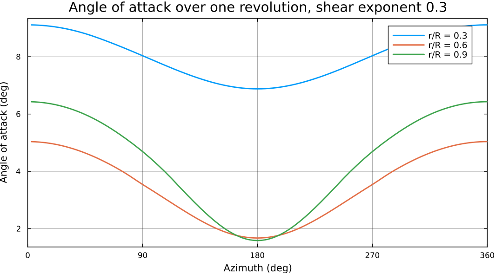
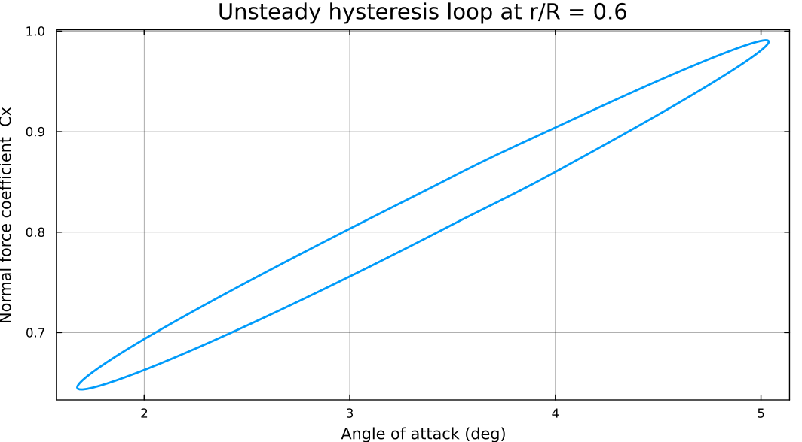

# Aerodynamics-Only Analysis

Aerodynamics-only mode runs the full unsteady aerodynamic stack — BEMT plus the Beddoes-Leishman dynamic stall model — on a **rigid** blade. No GXBeam, no structural feedback, no assembly required.

```@meta
CurrentModule = WATT
``` 


## Setup

You only need the `blade`, `rotor`, and `env` exactly as they are shown in [Getting Started](gettingstarted.md).

Here we show using a power-law shear profile instead of uniform inflow:

```julia
shearexp = 0.3                       # power-law wind shear exponent
env = environment(rho, mu, a, vinf, omega, shearexp)
```


## Running it

Two calls — [`initialize_aero`](@ref) to allocate, [`simulate!`](@ref) to march:

```julia
omega = vinf*tsr/rtip
trev  = 2pi/omega                    # one revolution, ~5.24 s here

tvec = 0:(trev/120):(3*trev)         # 3 revolutions, 120 steps each

aerostates, mesh = initialize_aero(blade, tvec)
simulate!(aerostates, mesh, rotor, blade, env, tvec)
```

A difference from the coupled path worth noting: `initialize_aero` returns an [`AeroMesh`](@ref) rather than a [`SimMesh`](@ref); it carries the dynamic stall state but nothing structural.


## Reading the results

`aerostates` is the same [`AeroStates`](@ref) type the coupled solver produces,
so everything from [Getting Started](gettingstarted.md#Reading-the-results)
applies.

```julia
using Plots

azdeg    = mod.(aerostates.azimuth .* (180/pi), 360)
last_rev = (2*120+1):length(tvec)         # skip the first two revolutions (dynamic stall transient region)

p = plot(xlabel = "Azimuth (deg)", ylabel = "Angle of attack (deg)",
         xlims = (0, 360), xticks = 0:90:360)
for (idx, lbl) in ((7, "r/R = 0.3"), (14, "r/R = 0.6"), (22, "r/R = 0.9"))
    o = sortperm(azdeg[last_rev])         # sort so the line doesn't wrap
    plot!(p, azdeg[last_rev][o], aerostates.alpha[last_rev, idx][o] .* 180/pi,
          lab = lbl, lw = 2)
end
display(p)
```




```julia
idx = 14                                   # r/R = 0.6

p = plot(xlabel = "Angle of attack (deg)", ylabel = "Normal force coefficient  Cx")
plot!(p, aerostates.alpha[last_rev, idx] .* 180/pi,
         aerostates.Cx[last_rev, idx], lab = false, lw = 2)
display(p)
```




