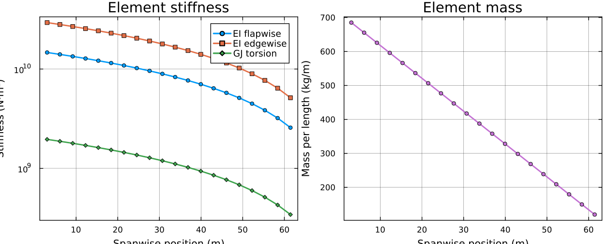
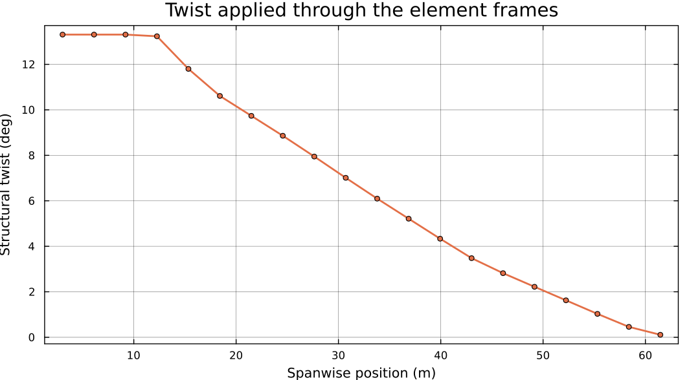

# Building an Assembly by Hand

The other tutorials get their structural model from
`OpenFASTTools.make_assembly`, which reads BeamDyn files. That is convenient
when you have OpenFAST inputs and useless when you do not.

`GXBeam.Assembly` is an ordinary struct with no OpenFAST in it anywhere. This
page builds one directly, which is what you need when your cross-sectional
properties come from
[GXBeamCS](https://github.com/byuflowlab/GXBeamCS.git), from a spreadsheet, from
a paper, or from analytical formulas during conceptual design.

## What an assembly is

Four things:

| Piece | What it is |
|---|---|
| `points` | Node positions, as 3-vectors. `ne + 1` of them for a simple beam. |
| `start` | For each element, the index of the point it begins at. |
| `stop` | For each element, the index of the point it ends at. |
| `elements` | Per-element stiffness, mass, orientation, and length. |

The keyword constructor builds the elements for you from per-element property
arrays, which is much easier than assembling `GXBeam.Element` objects yourself:

```julia
GXBeam.Assembly(points, start, stop;
                stiffness = ..., mass = ..., frames = ...)
```

## Geometry

Lay the nodes out along the span. **The blade reference line runs along the
global x axis**, matching what the aerodynamic side expects, with the root at
the hub radius:

```julia
using WATT, GXBeam, StaticArrays, LinearAlgebra, FLOWMath

rhub, rtip = 1.5, 63.0
ne = 20                                  # number of elements
L  = rtip - rhub

xpts     = range(rhub, rtip, length = ne + 1)
points   = [SVector(x, 0.0, 0.0) for x in xpts]

start = 1:ne                             # element i runs from point i ...
stop  = 2:(ne + 1)                       # ... to point i+1
```

For a straight blade the y and z components are zero. A swept or prebent blade
just puts nonzero values there — the rest of this page is unchanged. If your
elements are genuinely curved rather than straight chords between endpoints,
pass `lengths` and `midpoints` explicitly so GXBeam does not infer them from the
endpoint spacing.

Element properties are defined at element **midpoints**, not at nodes:

```julia
xmid = [(xpts[i] + xpts[i+1])/2 for i in 1:ne]
smid = (xmid .- rhub) ./ L               # normalized span, 0 at root, 1 at tip
```

## Stiffness and mass

GXBeam wants a 6×6 stiffness matrix and a 6×6 mass matrix per element, both in
the element's local frame. The 6 degrees of freedom are three translations then
three rotations, so the diagonal entries are:

| Index | Stiffness | Mass |
|---|---|---|
| 1 | `EA` — axial | mass per unit length |
| 2, 3 | `GA` — transverse shear | mass per unit length |
| 4 | `GJ` — torsion | polar inertia per unit length |
| 5 | `EI` — flapwise bending | flapwise inertia per unit length |
| 6 | `EI` — edgewise bending | edgewise inertia per unit length |

A real blade has substantial off-diagonal coupling — bend-twist coupling lives
at entry `(4,5)` — and a full cross-sectional analysis gives you those terms. For
a conceptual model, diagonal matrices with a taper are enough to get started:

```julia
taper(s) = 1.0 - 0.85*s                  # properties fall to 15% at the tip

EA0, GA0, GJ0 = 1.0e10, 4.0e9, 2.0e9     # N, N, N·m²
EI_flap0, EI_edge0 = 1.5e10, 3.0e10      # N·m²
m0, ip0 = 700.0, 400.0                   # kg/m, kg·m

stiffness = [Diagonal(SVector(EA0, GA0, GA0, GJ0, EI_flap0, EI_edge0) .* taper(s))
             for s in smid]

mass = [Diagonal(SVector(m0, m0, m0, ip0, ip0/2, ip0/2) .* taper(s))
        for s in smid]
```



Edgewise stiffness exceeds flapwise, as it should — a blade is much deeper
chordwise than it is thick.

!!! warning "Stiffness, not compliance"
    The keyword constructor accepts either `stiffness` or `compliance`, and
    compliance is the *inverse*. Passing a stiffness matrix to the `compliance`
    keyword produces a blade roughly 10²⁰ times too floppy, which usually shows
    up as a solver that will not converge rather than an obviously wrong answer.

## Orientation: the element frames

`frames` holds a 3×3 rotation per element, transforming from the local
undeformed element frame to the global frame. **This is where structural twist
goes.** Get it wrong and the flapwise and edgewise stiffnesses end up swapped.

Since the reference line is along x, twist is a rotation about x:

```julia
twistfit = FLOWMath.Akima(collect((blade.r .- rhub) ./ L), collect(blade.twist))

frames = [WATT.rotate_x(-twistfit(s)) for s in smid]
```

The sign is negative because the rotation transforms *from* the local frame *to*
the global one, the opposite direction from the twist convention. `rotate_x`,
`rotate_y`, and `rotate_z` are in `WATT`'s utilities; any 3×3 rotation matrix
works.



If your blade has no twist, omit `frames` — it defaults to the identity.

## Assembling it

```julia
assembly = GXBeam.Assembly(points, start, stop;
                           stiffness = Matrix.(stiffness),
                           mass      = Matrix.(mass),
                           frames    = frames)
```

`Matrix.(...)` converts the `Diagonal` wrappers into dense 6×6 matrices, which
is what GXBeam stores.

That is a complete structural model. It goes straight into any WATT solver:

```julia
aerostates, gxstates, mesh = initialize_static(blade, assembly)
fixedpoint!(aerostates, gxstates, 0.0, rotor, env, blade, mesh, 0.0; iterations = 10)

state = GXBeam.AssemblyState(mesh.system, assembly;
                             prescribed_conditions = mesh.prescribed_conditions)
state.points[end].u          # tip deflection
```

For the properties above this gives about 0.73 m of flapwise tip deflection at
NREL 5MW rated conditions — considerably stiffer than the real blade's 4.7 m,
which is expected: these numbers were invented, not derived from a real section.

## Checking your model

Three checks worth running before trusting a hand-built assembly.

**Does the aerodynamic mesh line up?** The structural and aerodynamic nodes need
not coincide — WATT interpolates — but the structural span must *cover* the
aerodynamic stations, or the interpolation extrapolates and warns:

```julia
@assert assembly.points[1][1]   <= minimum(blade.r)
@assert assembly.points[end][1] >= maximum(blade.r)
```

**Is the element count sane?** GXBeam uses constant and linear shape functions,
so grid independence needs more elements than a higher-order formulation would.
Twenty is reasonable for a blade; converge it by refining until the tip
deflection stops moving.

**Is the mass right?** A quick integral catches order-of-magnitude slips:

```julia
total_mass = sum(mass[i][1,1] * (xpts[i+1] - xpts[i]) for i in 1:ne)
```

The real NREL 5MW blade is about 17,700 kg. The invented properties above give
roughly 24,800 kg — the right order of magnitude, which is all a made-up taper
should be trusted for. If you are off by 10×, a unit is wrong.

## Discretizing a curved beam

For curved or swept geometry, `GXBeam.discretize_beam` computes lengths,
endpoints, midpoints, and frames from a length, a start point, and a curvature
vector, which is easier than deriving them by hand:

```julia
lengths, points, midpoints, frames = GXBeam.discretize_beam(L, start_point, ne;
                                                            frame = root_frame,
                                                            curvature = kappa)
```

See the GXBeam documentation for the full treatment.

## Related

- [GXBeam.jl documentation](https://flow.byu.edu/GXBeam.jl/stable/) — the structural solver
- [GXBeamCS](https://github.com/byuflowlab/GXBeamCS.git) — computing 6×6 section properties
- [Getting Started](gettingstarted.md) — the OpenFAST route
- [For Developers](developers.md#Reference-frames) — the frame conventions in full
