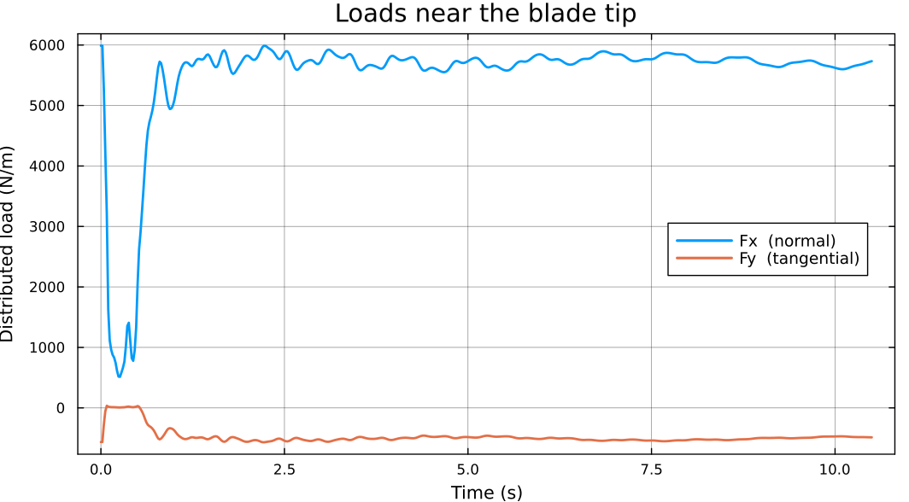
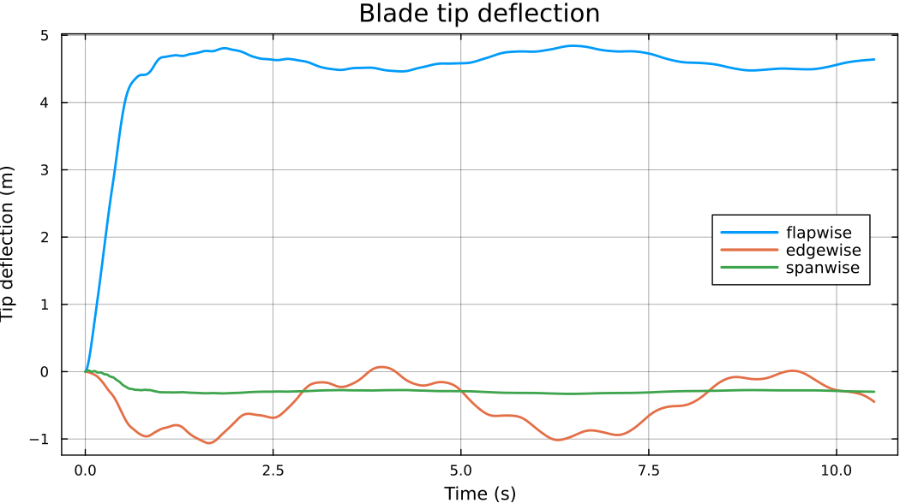

# Getting Started

This walks through a nonlinear unsteady aeroelastic analysis of the NREL 5MW reference turbine, from raw OpenFAST input files to tip deflections.

Everything on this page is runnable against the OpenFAST files shipped in the repository's `data/openfast` directory. Set `ofpath` to point there:

```julia
using WATT, GXBeam, DynamicStallModels, OpenFASTTools, StaticArrays

DS = DynamicStallModels
of = OpenFASTTools

ofpath = joinpath(pkgdir(WATT), "data", "openfast")
afpath = joinpath(ofpath, "airfoils")
```

[OpenFASTTools](https://github.com/byuflowlab/OpenFASTTools.jl.git) is not a dependency of WATT — it is just a convenient way to read OpenFAST inputs. If your geometry comes from somewhere else, you only need to produce the arrays described below.

## Preparing inputs

A simulation needs four objects: a [blade](#Blade) and a [rotor](#Rotor) for the aerodynamics, a [structural assembly](#Structural-assembly) for the structure, and an [environment](#Environment) for the inflow. Each gets its own section below.

### Airfoils

The blade carries a *dynamic* airfoil polar at each station, from
[DynamicStallModels](https://github.com/byuflowlab/DynamicStallModels.jl.git).
`make_dsairfoil` returns the polar and the airfoil reference point `xcp` — the
chordwise location where the chord line meets the blade reference line.

```julia
aftypes = [of.read_airfoilinput(joinpath(afpath, f)) for f in
           ("Cylinder1.dat", "Cylinder2.dat", "DU40_A17.dat", "DU35_A17.dat",
            "DU30_A17.dat", "DU25_A17.dat", "DU21_A17.dat", "NACA64_A17.dat")]

adblade = of.read_adblade("sn5_adblade.dat", ofpath)
af_idx  = Int.(adblade["BlAFID"])   # which airfoil each station uses

made     = [of.make_dsairfoil(aftypes[i]) for i in af_idx]
airfoils = first.(made)
xcp      = last.(made)
```

!!! note "Airfoils are a plain `Vector`"
    `Blade` stores its airfoils as an ordinary `Vector{<:DS.Airfoil}`. Earlier
    versions of this tutorial built a `StructArray`; that is no longer correct,
    and `StructArrays` is not a dependency. Building the vector with a
    comprehension, as above, gives a concretely-typed result.

### Blade

The blade is defined by a reference line running root to tip, measured from the center of rotation, plus distributions of chord, twist, reference point, and airfoil polar along it. The convenience constructor builds the reference line for you from a vector of radial stations.

```julia
edfile   = of.read_edfile("sn5_EDfile.dat", ofpath)

rhub     = edfile["HubRad"]            # radial location of hub edge, meters
rvec     = adblade["BlSpn"] .+ rhub    # radial stations, measured from rotation center, meters
rtip     = rvec[end]                   # radial location of blade tip, meters
chordvec = adblade["BlChord"]          # chord values at every aerodynamic node, meters
twistvec = adblade["BlTwist"] .* (pi/180)   # twist value at every aerodynamic node, radians (OpenFAST stores degrees-> WATT requires radians)

blade = Blade(rvec, chordvec, twistvec, xcp, airfoils; rhub, rtip)
```

Twist **must** be in radians.


### Rotor

```julia
B       = 3        # number of blades
hubht   = 80.0     # hub height, meters
turbine = true     # turbine convention (as opposed to propeller)

rotor = Rotor(B, hubht, turbine; tilt = 0.0, yaw = 0.0)
```

`tilt` and `yaw` are in radians. [`Rotor`](@ref) also accepts optional Mach, Reynolds, rotational, and tip-loss correction models. See CCBlade for examples. 

### Structural assembly

The structural mesh follows the same reference line as the aerodynamic one, but need not use the same nodes (WATT interpolates between them). WATT uses `GXBeam.Assembly` directly, so any way of building one works.Here we read a BeamDyn model:

```julia
bdfile  = of.read_bdfile("sn5_BDfile.dat", ofpath)
bdblade = of.read_bdblade("sn5_BDblade.dat", ofpath)

assembly = of.make_assembly(edfile, bdfile, bdblade)
```

!!! note
    Note that OpenFAST stores it's stiffness and mass matrices in a different order than GXBeam does. OpenFASTTools automatically switches the order. [GXBeamCS](https://github.com/byuflowlab/GXBeamCS.git) is useful for computing the cross-sectional mass and compliance matrices from scratch (in the correct order).

### Environment

For steady inflow, use the [`environment`](@ref) constructor:

```julia
rho = 1.225     # density, air, kg/meters^3
mu = 1.464e-5   # dynamic viscosity, air, Pa·s
a = 343.0       # speed of sound, air, meters/second
shearexp = 0.0    # No wind shear for a power law wind shear profile

vinf  = 10.0                 # freestream, m/s
tsr   = 7.55                 # tip speed ratio
omega = vinf*tsr/rtip        # rotor speed, rad/s

env = environment(rho, mu, a, vinf, omega, shearexp)
```

For turbulent inflow, `environment` has two further methods that read a TurbSim file directly and fit interpolants through it: one that uses [the whole file](@ref environment(::String, ::Number, ::Number, ::Number, ::Number, ::Number)), and one that [starts at a given time offset](@ref environment(::String, ::Number, ::Number, ::Number, ::Number, ::Number, ::Number)).

```julia
env_turb = environment(joinpath(ofpath, "TurbSim.dat"), rho, mu, a, omega, shearexp)
```

For anything else, build a [`SimpleEnvironment`](@ref) directly. It holds eight
callables — inflow velocity and its derivative, rotor speed and its derivative,
and so on — each queried as `f(t)`:

```julia
struct GustySpeed{TF}
    mean::TF
    amp::TF
    period::TF
end
(g::GustySpeed)(t) = g.mean + g.amp*sin(2pi*t/g.period)

struct GustyVector{TF}
    speed::GustySpeed{TF}
end
(g::GustyVector)(t) = SVector(g.speed(t), 0.0, 0.0)

speed = GustySpeed(10.0, 2.0, 2.0)

env_gusty = SimpleEnvironment(
    rho, mu, a, shearexp,
    GustyVector(speed),                    # U        — inflow velocity vector
    WATT.Constant(SVector(0.0, 0.0, 0.0)), # Omega    — inflow swirl
    WATT.Constant(SVector(0.0, 0.0, 0.0)), # Udot     — inflow acceleration
    WATT.Constant(SVector(0.0, 0.0, 0.0)), # Omegadot — swirl acceleration
    speed,                                 # Vinf     — inflow speed magnitude
    WATT.Constant(omega),                  # RS       — rotor speed
    WATT.Constant(0.0),                    # Vinfdot
    WATT.Constant(0.0),                    # RSdot
)
```

!!! tip "Prefer named callable structs to anonymous closures"
    Anonymous closures work, but their gensym'd types do not survive
    serialization — an environment built from closures cannot be round-tripped
    through JLD2, so saved reference simulations have to rebuild it by hand.
    Named callable structs like `GustySpeed` above avoid that, and keep the
    number of distinct method specializations down. `WATT.Constant` is provided
    for the common case.

## Running a coupled simulation

Allocate the state histories and coupling buffers, then march:

```julia
tvec = 0:0.02:10.5     # ~2 rotor revolutions at this rotor speed

aerostates, gxhistory, mesh = initialize_sim(blade, assembly, tvec)

run_sim!(rotor, blade, mesh, env, tvec, aerostates, gxhistory)
```

[`initialize_sim`](@ref) sizes every buffer from `length(tvec)`, so the time vector is needed up front. [`run_sim!`](@ref) fills them in place. Pass
`verbose = true` to either for progress output.

If you would rather not manage the buffers, [`run_sim`](@ref) does both steps and returns the results:

```julia
aerostates, gxhistory, mesh = run_sim(rotor, blade, assembly, env, tvec)
```

## Reading the results

### Aerodynamic states

`aerostates` is an [`AeroStates`](@ref) struct. Each field is a `(nt, n)` matrix
— time by radial station:

```julia
julia> propertynames(aerostates)
(:azimuth, :phi, :alpha, :W, :Cx, :Cy, :Cm, :Fx, :Fy, :Mx, :xds)
```

`Fx` and `Fy` are distributed forces per unit span; `Mx` is distributed moment.
`xds` holds the dynamic stall states.

```julia
using Plots

tiploads = plot(xlabel = "Time (s)", ylabel = "Distributed load (N/m)")
plot!(tiploads, tvec, aerostates.Fx[:, end-1], lab = "Fx  (normal)", lw = 2)
plot!(tiploads, tvec, aerostates.Fy[:, end-1], lab = "Fy  (tangential)", lw = 2)
display(tiploads)
```



Note the station index `end-1` rather than `end` — the outermost station sits at the tip, where the tip-loss correction drives the load toward zero.

To integrate the distributed loads into rotor thrust and torque histories, use
[`rotorloads`](@ref) — pass one `loads` argument per blade:

```julia
thrust, torque = rotorloads(rhub, rtip, blade.r, aerostates)
```

### Structural states

`gxhistory` is a `Vector{GXBeam.AssemblyState}`, one entry per time step:

```julia
nt = length(tvec)

tipdef_x = [gxhistory[i].points[end].u[1] for i in 1:nt]
tipdef_y = [gxhistory[i].points[end].u[2] for i in 1:nt]
tipdef_z = [gxhistory[i].points[end].u[3] for i in 1:nt]
```

Rotations are stored as Wiener-Milenkovic parameters. Convert them to Euler
angles with `WATT.WMPtoangle`:

```julia
tiptheta_x = zeros(nt)
tiptheta_y = zeros(nt)
tiptheta_z = zeros(nt)

for i = 1:nt
    theta = WATT.WMPtoangle(gxhistory[i].points[end].theta)
    tiptheta_x[i] = theta[1]
    tiptheta_y[i] = theta[2]
    tiptheta_z[i] = theta[3]
end

tipdefs = plot(xlabel = "Time (s)", ylabel = "Tip deflection (m)")
plot!(tipdefs, tvec, -tipdef_z, lab = "flapwise", lw = 2)   # OpenFAST reference frame
plot!(tipdefs, tvec,  tipdef_y, lab = "edgewise", lw = 2)
plot!(tipdefs, tvec,  tipdef_x, lab = "spanwise", lw = 2)
display(tipdefs)
```



## Where to go next

- [Aerodynamics-Only Analysis](aeroonly.md) — hold the blade rigid to isolate the aerodynamics
- [Steady Aeroelastic Analysis](steady.md) — the equilibrium the blade settles into
- [Gradients and Sensitivities](gradients.md) — differentiating a simulation for optimization
- [Building an Assembly by Hand](assembly.md) — structural models without OpenFAST inputs
