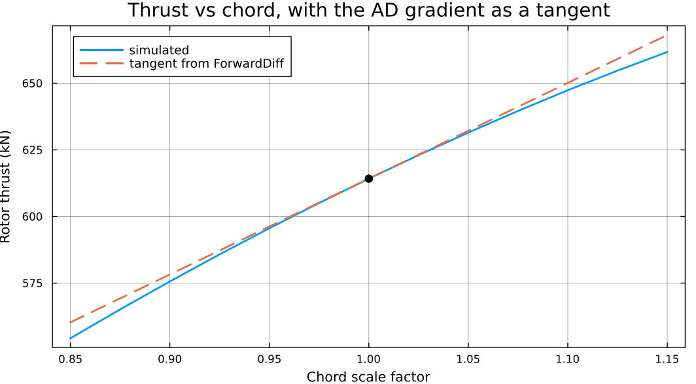

# Gradients and Sensitivities

WATT exists to be differentiated. The whole simulation — BEMT root-find, dynamic
stall state march, geometrically exact beam solve, time integration — is
transparent to ForwardDiff and ReverseDiff, so you can get exact derivatives of
a simulated quantity with respect to design variables and hand them to a
gradient-based optimizer.

This page builds one up from scratch and checks it against finite differences.

```@meta
CurrentModule = WATT
```

## The one rule: rebuild the blade inside the function
<!-- Todo: I don't think that this rule is actually required. You could probably pre-allocate and be fine (we should investigate that). Additionally, this doesn't use pfunc at all... so it's propagating derivatives through the nonlinear solve (if it works at all). Does examples and tests not have a correct example of computing derivatives? -->

Everything else follows from this. WATT decides what element type to allocate
its buffers with by inspecting the blade — [`find_inittype`](@ref) looks at
`blade.c[1]` and `blade.twist[1]` and, if either is a `ForwardDiff.Dual` or a
`ReverseDiff.TrackedReal`, allocates every downstream buffer with that type.

So the differentiated function must construct a `Blade` whose chord and twist
carry the AD type. Reusing a `Blade` built outside the function pins everything
to `Float64` and the derivative comes back zero.

## A worked example

Take rotor thrust as a function of two design variables — a multiplier on chord
and an offset on twist:

```julia
using WATT, FLOWMath, ForwardDiff

tvec = range(0.0, 0.06, length = 4)     # short window; see "Cost" below

function meanthrust(x)
    TF = eltype(x)                      # Float64, or a Dual under AD
    cscale, dtwist = x[1], x[2]

    # Rebuild the blade so chord and twist carry TF.
    bld = Blade(blade.r,
                blade.c .* cscale,
                blade.twist .+ dtwist,
                blade.xcp, blade.airfoils;
                rhub = blade.rhub, rtip = blade.rtip)

    aerostates, mesh = initialize_aero(bld, tvec)
    simulate!(aerostates, mesh, rotor, bld, env, tvec)

    # Integrate distributed load into thrust, averaged over the window.
    rfull = [bld.rhub; bld.r; bld.rtip]
    s = zero(TF)
    for i in eachindex(tvec)
        s += 3 * FLOWMath.trapz(rfull, [zero(TF); aerostates.Fx[i, :]; zero(TF)])
    end
    return s / length(tvec)
end
```

Note `zero(TF)` rather than `0.0` in the accumulator and the padding — a literal
`0.0` would force a `Float64` array and silently drop the derivative
information. This is the second most common mistake after reusing the blade.

Then the gradient is one call:

```julia
x0 = [1.0, 0.0]                         # nominal chord, no twist offset
g  = ForwardDiff.gradient(meanthrust, x0)
```

which gives

```
thrust      = 614.193 kN
AD gradient = [3.594775e+05, -2.311224e+06]
```

Thrust rises with chord (more area) and falls sharply with added twist (lower
angle of attack) — both the right sign, and the twist sensitivity is far larger
because it is per radian.

## Verifying against finite differences

Always do this once when setting up a new objective. It is cheap and it catches
a silently-zero derivative immediately:

```julia
function cdiff(f, x, i, h)
    xp = copy(x); xp[i] += h
    xm = copy(x); xm[i] -= h
    return (f(xp) - f(xm)) / (2h)
end

gfd = [cdiff(meanthrust, x0, 1, 1e-6), cdiff(meanthrust, x0, 2, 1e-7)]
relerr = abs.((g .- gfd) ./ gfd)
```

```
FD gradient = [3.594775e+05, -2.311224e+06]
rel error   = [5.93e-11, 1.91e-10]
```

Agreement to ~1e-10 — the AD result is exact and the finite difference is the
approximate one. Pick the step size per variable: chord is O(1) and twist is
O(0.01 rad), so a single `h` would be badly scaled for one of them.

Seen graphically, the gradient is the tangent to the response curve:



## Cost, and how to control it

ForwardDiff cost scales with the **number of design variables**: a gradient over
`n` variables costs roughly `n/chunk` forward passes. Two variables is free. Two
hundred is not.

Three ways to keep it manageable, in the order worth trying:

**1. Shorten the time window.** The dominant cost is the march itself. If the
quantity of interest converges in a few steps, do not simulate a hundred
seconds. The example above uses four steps.

**2. Chunk the configuration.** For more than a handful of variables, set the
chunk size explicitly to trade memory against passes:

```julia
cfg = ForwardDiff.GradientConfig(meanthrust, x0, ForwardDiff.Chunk{8}())
g   = ForwardDiff.gradient(meanthrust, x0, cfg)
```

**3. Use a frozen-start window.** This is the big one, and the reason
[`step_solution!`](@ref) exists — see below.

## Windowed sensitivities
<!-- Todo: The motivation in this script isn't correct. The purpose is to provide derivatives for training surrogates. I don't know if these windowed derivatives are correct either. -->

Often the quantity you care about depends on a short window late in a
simulation: a fatigue cycle at t = 90 s, the response to a gust, a peak load
during one revolution. Differentiating the whole march to get it is enormously
wasteful.

Instead: march to the window's start in plain `Float64`, freeze that state, and
differentiate only the window.

```julia
# 1. Warm up in Float64 — no duals, full speed.
aerostates, gxhistory, mesh = initialize_sim(blade, assembly, tvec_warmup)
run_sim!(rotor, blade, mesh, env, tvec_warmup, aerostates, gxhistory)

# 2. Snapshot the coupled state at the end of the warmup.
state0   = mesh.system.x
xds0     = aerostates.xds[end, :, :]
azimuth0 = aerostates.azimuth[end]

# 3. Differentiate only the window that starts there.
function windowed(p)
    ast, gxh, m = initialize_from_state(state0, xds0, azimuth0, mesh, blade, env,
                                        tvec_window, t0)
    run_from_state!(rotor, blade, m, env, tvec_window, ast, gxh)
    # ... objective over the window ...
end
```

The frozen snapshot is treated as a constant — it carries no partials — so the
gradient is the sensitivity of the window given that starting state. That is
usually exactly what a windowed load or fatigue objective means. See
[`initialize_from_state`](@ref), [`run_from_state!`](@ref), and
[`step_solution!`](@ref) for the single-step primitive underneath, plus
`examples/step_solution_ad.jl`.

!!! note ReverseDiff gradients are RAM heavy
  The current implementation results in ReverseDiff tapes that are very RAM heavy. If the code is extended to use a dynamic stall model that does not have branching code, then the tape for a single time step could be reused across an entire simulation. Similarly, source code transformation could make for efficient reverse mode derivatives. 

## Known limitations

- **No GPU path is differentiable.** The kernels are forward-pass only.
- **`fixedpoint!` is unverified.** There is no AD test covering the steady
  solver. It may work; nothing checks it. Verify against finite differences
  before relying on it.

## Related

- [`step_solution!`](@ref), [`initialize_from_state`](@ref), [`run_from_state!`](@ref)
- [Aerodynamics-Only Analysis](aeroonly.md) — the cheapest mode to differentiate
- [For Developers](developers.md#AD-architecture) — the architecture in full
